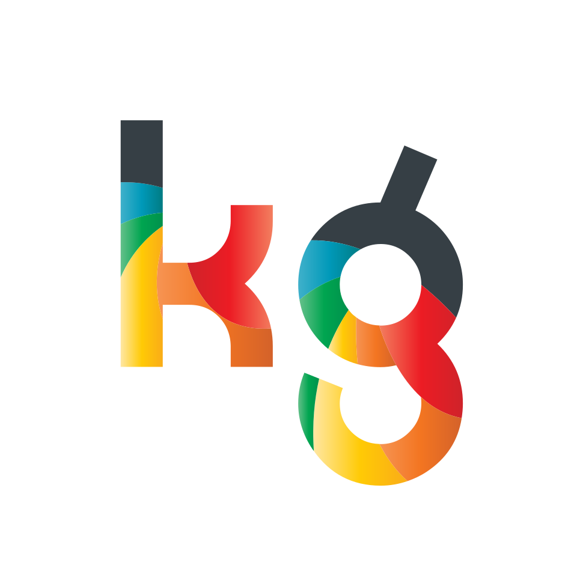

<p align="center">
  
  <h3 align="center">VuePress Portfolio</h3>
  <p align="center">VuePress site with portfolio and blogging pages<br>ready to deploy, and configured for Forestry (Content Management)<p>
</p>


## Development

```bash
# install VuePress locally
npm i -g vuepress

# cd into the VuePress directory
cd portfolio

# Start local dev server
vuepress dev
```

## Build

```bash
# Build static files to .vuepress/dist
vuepress build
```

## Deploy with Netlify

Import your site in Netlify

1. Create a new site in Netlify and import your repository.
2. Set the build command to: `npm run site:build`
3. Set the publish directory to `portfolio/.vuepress/dist`

That's it, now your site gets deployed automatically on `git push`

## Forestry (Content Management)

This project has been pre-configured to work with Forestry, just import your repository ✨  
Any changes you make will be commited back to the repo, and deployed if you're using Netlify.

[](https://app.forestry.io/quick-start?repo=forestryio/portfolio-vuepress&provider=github&engine=vuepress)
